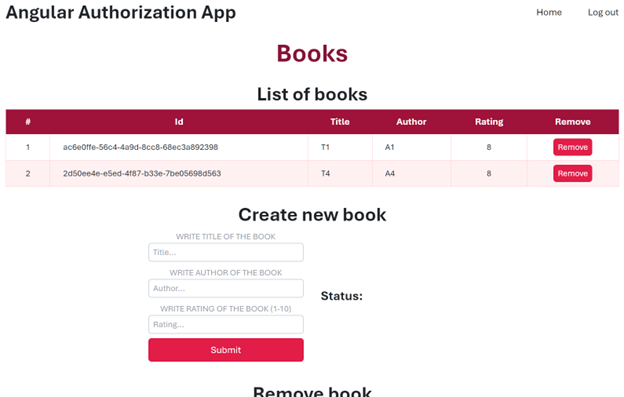
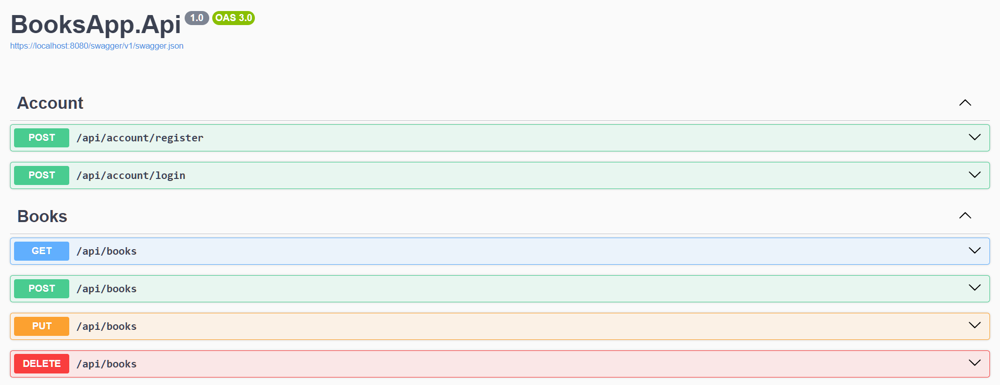

# Books App 

## Overview

Books App is a full-stack web application designed to demonstrate Login and Registration functionality using ASP.NET Core Identity with an Angular client.

**<small>Client Page:</small>**


**<small>API Endpoints in Swagger:</small>**


## Technologies Used

### Backend
- ASP.NET Core
- ASP.NET Core Identity
- Entity Framework Core
- SQLite

### Frontend
- Angular 19
- TypeScript
- Prettier
- ESLint
- Tailwind CSS

## Features

### Users
- Register a new user with an email and password, automatically assigned the "Guest" role.
- Passwords must meet specific criteria, including length and the use of symbols.
- Log in to an account using an email and password, and receive a Bearer Token stored in localStorage.

### Book Management
- Unauthorized users cannot access any book-related features. 
- Users with the "Guest" role can view the list of books but cannot modify the data. 
- Users with the "Admin" role, in addition to the "Guest" role's capabilities, can:
  - Remove books by ID. 
  - Create new books. 
  - Update books by ID.

## Running the Application
### Backend
```shell
dotnet run
```

It will start on `http://localhost:8080` by default

### Frontend
```shell
ng serve
```

It will start on `http://localhost:4200` by default

# Project Structure

## Backend (`BooksApp.Api`)
- `Configuration/`: Configuration files for user roles and role assignments
- `Controllers/`: API endpoints
- `Contracts/`: Records of requests and responses
- `DataAccess/`: Database context of the app
- `Database`: SQLite database file
- `Models/`: Data models
- `Repositories/`: Data access logic
- `Migrations/`: Database schema migrations
- `Service/`: Login for generating JWT Tokens

## Frontend (`BooksApp.Client`)
- `src/app/book`: Components for managing books, including forms to get, create, update, and remove books
- `src/app/shared/`: Shared interfaces and services
- `src/app/login/`, `src/app/login/login-out` and `src/app/registration`: Components for login, logout, and registration forms

> I realize that the structure of `BooksApp.Client` is far from ideal

# API Endpoints
- `POST /api/account/register`: Register a new user
- `POST /api/account/login`: Log in to an account
- `GET /api/books`: Retrieve a list of books
- `POST /api/books`: Create a new book
- `PUT /api/books`: Update a book
- `DELETE /api/books`: Remove a book
